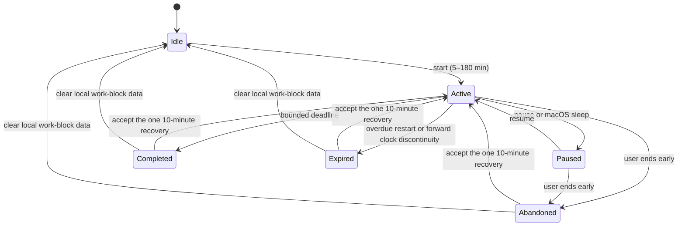

# Local Meaningful-Work Loop

Scope 2 adds one device-local loop: declare an optional intention, run a
bounded work block, see safe category evidence, receive one Rust-derived
result, and optionally start one ten-minute recovery block. It does not add
screen recording, input monitoring, application blocking, cloud analytics, or
new notification behavior.

## Ownership

- Swift renders `WorkBlockSnapshot` and sends direct user or OS-lifecycle
  commands. It does not persist intention, aggregate observations, calculate a
  result, or author behavioral claims.
- Rust owns the versioned state machine, SQLite persistence, event-to-session
  aggregation, coverage/confidence rules, deterministic status/result copy,
  idempotent completion, and restart recovery.
- `proto/` protocol version 15 defines the local-only commands and snapshot.
- The cloud API and upload DTOs are unchanged.

Rust receives only the already-abstracted category, classification status, and
confidence from the existing abstraction engine. Category switching is counted
as a neutral observed transition. It is never sufficient evidence of
distraction, failure, or intent.

## State Machine

Terminal result creation is atomic and unique by block ID. Repeating a
deadline, restart, or end path returns the persisted result instead of creating
a second outcome. A restart restores an unexpired active or paused block;
overdue active work becomes `expired` with honest coverage. Sleep pauses a
block. Wake leaves it paused so sleep time is not invented. Time-zone changes
do not alter UTC timing, and backward wall-clock changes cannot reduce elapsed
time below the last persisted update.

An active deadline uses a replaceable one-shot Tokio sleep. UI updates come
from state changes, abstraction events, and OS notifications; the work-block
feature adds no polling loop.

## Result Rules

Rust closes adjacent safe category observations and derives planned and elapsed
duration, longest uninterrupted category stretch, neutral transitions away
from the dominant covered category, returns to it, coverage and confidence, one
safe evidence category when supported, deterministic observation copy, and
exactly one bounded `protect_next_10` action.

Ambiguous, unclassified, low-confidence, system, and unlogged spans do not
support a confident category claim. Coverage below 25% yields `insufficient`,
confidence `none`, no evidence category, and explicit incomplete-result copy.
Purpose selects bounded recovery wording. Intensity selects calm active status
wording; intense mode does not weaken evidence rules or increase notification
volume. The phrase “your task” is not generated unless a local intention exists
and the block is active; the current library avoids that phrase entirely.

## Exact Local and Cloud Field Table

| Field | Local command / IPC | Protected SQLite | Cloud upload/cache | Logs, telemetry, crash-safe diagnostics | Notification ID |
|---|---:|---:|---:|---:|---:|
| Free-form `intention` | Yes, local socket only | Yes, `work_block.intention`, cleared after 24 hours | Never | Never; custom `Debug` redacts it | Never |
| `block_id` | Yes | Yes | Never | Safe identifier only | Never |
| `phase` | Yes | Yes | Never | Safe enum only | Never |
| `purpose` | Yes | Yes | Never | Safe enum only | Never |
| `intensity` | Yes | Yes | Never | Safe enum only | Never |
| planned/elapsed/paused timestamps | Yes | Yes | Never | Safe timing metadata only | Never |
| abstracted category/status/confidence | Yes | Yes, observation rows | Existing abstract-event upload remains unchanged; no work-block association | Existing safe values only | Never |
| longest stretch / switch-away / recovery counts | Result snapshot | Yes, safe result JSON | Never | Safe aggregate only | Never |
| coverage/confidence/evidence category | Result snapshot | Yes, safe result JSON | Never | Safe aggregate only | Never |
| Rust-authored observation | Result snapshot | Yes, safe result JSON | Never | Not logged by the work-block path | Never |
| one bounded next action | Result snapshot | Yes, safe result JSON | Never | Safe reviewed copy only | Never |

The database parent and file are set to user-only permissions on Unix
(`0700`/`0600`). Intention retention is deliberately shorter than safe session
results. The in-app “Clear Local Work Blocks” command deletes blocks,
observations, and results. The existing full local-data procedure also removes
the database.

## Focus/DND Citizenship (0.1.6 Scope 1)

Swift observes the system Focus/DND state through `INFocusStatusCenter` — a
single authorized boolean sampled at app activations, wake, and IPC
reconnects — and reports coarse edge transitions over `focus_state_changed`.
Rust owns the evidence record: transition times are floored to five-minute
buckets, reduced to local hour/date buckets, pruned after 14 days, and the
schema has no column that could hold a Focus mode's name, configuration, or
schedule.

Decisions derived from that record, all in Rust:

- A drift offer whose gate clears while DND is active is recorded as
  `delivery_suppressed_dnd` (terminal at creation), delivered on no channel,
  and never retried mid-block. It starts the normal re-offer cooldown,
  counts toward the per-block offer cap, is excluded from
  delivered-intervention metrics, and reconciles after the block as a count
  inside at most one calm result line (`result.reconciliation`).
- A block that completes while DND is active records `completed_under_dnd`
  in `result.dnd_outcomes` and stays a completed block everywhere.
- Late-night DND on three or more distinct local days within seven days
  (pattern rule v1) produces one next-morning `quiet_hours_offer`. One tap
  configures Velvt's own quiet hours (22:00-07:00 local, OS-notification
  suppression only); a decline is remembered for 30 days. Velvt never edits
  the macOS Focus configuration.

## Failure Behavior

- Offline Swift sends fail without creating optimistic local state. Persisted
  Rust state is recovered when the helper returns.
- A protocol-15 mismatch fails during the existing handshake; no command is
  interpreted under an older contract.
- Missing or ambiguous classification produces an unclear current category and
  never a confident behavioral claim.
- Clearing work-block data cancels the one-shot deadline and returns `idle`.

## Verification

Focused tests cover every transition, restart/expiry and idempotence,
sleep/wake and clock changes, Rust aggregation, insufficient coverage, one
action, local-only intention isolation, v8-to-v9 SQLite migration, clear data,
offline Swift behavior, lifecycle commands, protocol round trips, and
notification separation. The full Rust and Swift suites plus the Xcode app
target remain the release checks.

## Before/After Resource Sample

Measured on the same Apple Silicon Mac on 2026-07-17 from accepted Scope 1
commit `5ef4fae2a76cc372b8e42dd5e606de4f7cafe821` and this branch. These are
small local smoke measurements, not production fleet claims.

| Measure | Scope 1 before | Scope 2 after | Method |
|---|---:|---:|---|
| Popover construction/show smoke test | 193 ms median | 192 ms median | 5 warm runs of `MenuBarControllerTests.testShowPopoverActivatesTheAppBeforeShowing` with `swift test --skip-build` |
| Rust helper idle CPU | 0.0% median | 0.0% median | 5 release-process samples after 3 seconds idle, `ps` |
| Rust helper idle RSS | 6,608 KiB median | 6,944 KiB median | same 5 samples; +336 KiB (+5.1%) |

The popover number includes controller/view construction, status-item install,
and the show action in the existing test harness; it is a reproducible proxy,
not an instrumented click-to-first-pixel measurement. The helper sample had no
active block, network credentials, or client connection. CPU remained at the
tool's 0.1% reporting floor, consistent with the one-shot deadline design.
