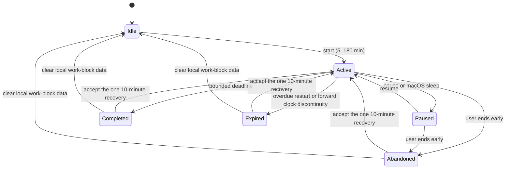

# Local Meaningful-Work Loop

Scope 2 adds one device-local loop: declare an optional intention, run a
bounded work block, see safe category evidence, receive one Rust-derived
result, and optionally start one ten-minute recovery block. It does not add
screen recording, input monitoring, application blocking, cloud analytics, or
new notification behavior.

## Ownership

- Swift renders `WorkBlockSnapshot` and sends direct user or OS-lifecycle
  commands. It does not persist intention, aggregate observations, calculate a
  result, or author behavioral claims.
- Rust owns the versioned state machine, SQLite persistence, event-to-session
  aggregation, coverage/confidence rules, deterministic status/result copy,
  idempotent completion, and restart recovery.
- `proto/` protocol version 15 defines the local-only commands and snapshot.
- The cloud API and upload DTOs are unchanged.

Rust receives only the already-abstracted category, classification status, and
confidence from the existing abstraction engine. Category switching is counted
as a neutral observed transition. It is never sufficient evidence of
distraction, failure, or intent.

## State Machine

Terminal result creation is atomic and unique by block ID. Repeating a
deadline, restart, or end path returns the persisted result instead of creating
a second outcome. A restart restores an unexpired active or paused block;
overdue active work becomes `expired` with honest coverage. Sleep pauses a
block. Wake leaves it paused so sleep time is not invented. Time-zone changes
do not alter UTC timing, and backward wall-clock changes cannot reduce elapsed
time below the last persisted update.

An active deadline uses a replaceable one-shot Tokio sleep. UI updates come
from state changes, abstraction events, and OS notifications; the work-block
feature adds no polling loop.

## Result Rules

Rust closes adjacent safe category observations and derives planned and elapsed
duration, longest uninterrupted category stretch, neutral transitions away
from the dominant covered category, returns to it, coverage and confidence, one
safe evidence category when supported, deterministic observation copy, and
exactly one bounded `protect_next_10` action.

Ambiguous, unclassified, low-confidence, system, and unlogged spans do not
support a confident category claim. Coverage below 25% yields `insufficient`,
confidence `none`, no evidence category, and explicit incomplete-result copy.
Purpose selects bounded recovery wording. Intensity selects calm active status
wording; intense mode does not weaken evidence rules or increase notification
volume. The phrase “your task” is not generated unless a local intention exists
and the block is active; the current library avoids that phrase entirely.

## Exact Local and Cloud Field Table

| Field | Local command / IPC | Protected SQLite | Cloud upload/cache | Logs, telemetry, crash-safe diagnostics | Notification ID |
|---|---:|---:|---:|---:|---:|
| Free-form `intention` | Yes, local socket only | Yes, `work_block.intention`, cleared after 24 hours | Never | Never; custom `Debug` redacts it | Never |
| `block_id` | Yes | Yes | Never | Safe identifier only | Never |
| `phase` | Yes | Yes | Never | Safe enum only | Never |
| `purpose` | Yes | Yes | Never | Safe enum only | Never |
| `intensity` | Yes | Yes | Never | Safe enum only | Never |
| planned/elapsed/paused timestamps | Yes | Yes | Never | Safe timing metadata only | Never |
| abstracted category/status/confidence | Yes | Yes, observation rows | Existing abstract-event upload remains unchanged; no work-block association | Existing safe values only | Never |
| longest stretch / switch-away / recovery counts | Result snapshot | Yes, safe result JSON | Never | Safe aggregate only | Never |
| coverage/confidence/evidence category | Result snapshot | Yes, safe result JSON | Never | Safe aggregate only | Never |
| Rust-authored observation | Result snapshot | Yes, safe result JSON | Never | Not logged by the work-block path | Never |
| one bounded next action | Result snapshot | Yes, safe result JSON | Never | Safe reviewed copy only | Never |

The database parent and file are set to user-only permissions on Unix
(`0700`/`0600`). Intention retention is deliberately shorter than safe session
results. The in-app “Clear Local Work Blocks” command deletes blocks,
observations, and results. The existing full local-data procedure also removes
the database.

## Focus/DND Citizenship (0.1.6 Scope 1)

Swift observes the system Focus/DND state through `INFocusStatusCenter` — a
single authorized boolean sampled at app activations, wake, and IPC
reconnects — and reports coarse edge transitions over `focus_state_changed`.
Rust owns the evidence record: transition times are floored to five-minute
buckets, reduced to local hour/date buckets, pruned after 14 days, and the
schema has no column that could hold a Focus mode's name, configuration, or
schedule.

Decisions derived from that record, all in Rust:

- A drift offer whose gate clears while DND is active is recorded as
  `delivery_suppressed_dnd` (terminal at creation), delivered on no channel,
  and never retried mid-block. It starts the normal re-offer cooldown,
  counts toward the per-block offer cap, is excluded from
  delivered-intervention metrics, and reconciles after the block as a count
  inside at most one calm result line (`result.reconciliation`).
- A block that completes while DND is active records `completed_under_dnd`
  in `result.dnd_outcomes` and stays a completed block everywhere.
- Late-night DND on three or more distinct local days within seven days
  (pattern rule v1) produces one next-morning `quiet_hours_offer`. One tap
  configures Velvt's own quiet hours (22:00-07:00 local, OS-notification
  suppression only); a decline is remembered for 30 days. Velvt never edits
  the macOS Focus configuration.

## Initiation Invitations (0.1.6 Scope 3)

Rust derives per-user good-hours windows from the safe local aggregates the
loop already keeps — completed work blocks and their confident category
dwell, split across local hour boundaries and bucketed by (weekday, hour).
The derivation is a deterministic, versioned policy (`good_hours_policy_v1`)
with explicit minimum-sample gates: at least 6 completed blocks in the
28-day lookback, and a bucket qualifies only with dwell from at least 3
distinct completed blocks totalling at least 45 minutes. Below any gate the
policy answers `insufficient_evidence` and extends nothing — never an
invented pattern or a generic default window. Nothing is learned or
adaptive; the learned good-hours model is 0.2.0 and does not exist here.

When the current local hour is a good hour, Rust extends at most one
invitation per local day (versioned cap, enforced in Rust) as an in-app
card only — no OS notification, no new delivery channel. The invitation is
suppressed while any block is active or paused, inside Velvt quiet hours,
while system Focus/DND is active, and by the single opt-out setting
(`initiation_settings`, Rust-owned; the explicit choice survives clearing
behavioral data). One tap starts a 25-minute declared block through the
existing `start_work_block` command carrying the invitation id; the block
records a content-free `origin` marker (`manual` | `invitation`) that never
crosses IPC and cannot reconstruct a schedule. An invited block inherits
the entire 0.1.5 intervention/outcome machinery unchanged.

Invitation outcomes are a separate bounded enum in the local
`initiation_invitation` store: `accepted`, `dismissed`, `no_response`
(the 30-minute response window lapsed silently), and `expired` (state
invalidated the offer: quiet hours, a block starting, opt-out,
logout/account switch, clear-all-data, or an incompatible policy version).
Backoff mirrors the intervention policy (`invitation_backoff_v1`): each
trailing dismissal doubles the next invitation's 24-hour base spacing, and
three trailing dismissals silence invitations entirely for 30 days after
the most recent one. Acceptance resets the count; silence and invalidation
change nothing. No path increases frequency, salience, or emotional charge.

An invited block that ends early offers the second registered action,
`soft_restart_10` ("Want back in? 10-minute soft restart."), through the
same recovery path as `protect_next_10`. The registry stays closed: the
schema constrains both action ids, and `accept_recovery` honors only the
action the terminal result actually offered.

Good-hours windows, weekday/hour buckets, and hour-precision timing exist
only inside the local database. The invitation payload is schedule-free by
construction, and no field derived by this policy reaches upload,
telemetry, or log paths.

## Auto-Demotion, Weekly Receipts, and the Explain Probe (0.1.6 Scope 4)

Auto-demotion (roadmap invariant 4; D5) is a deterministic, versioned rule
over the 0.1.5 wrong-intervention counter, owned by `WorkBlockManager`.
Over the rolling 14-day window — restarted at the last manual reset —
Velvt is `demoted` exactly while at least 10 interventions were delivered
(`demotion_threshold_v1` minimum sample) and strictly more than 15% of them
were answered "I was focused". While demoted, the drift gate records every
decision it would have made as a terminal `withheld_demotion` row instead
of offering: no card, no notification, no catch-up after re-promotion, and
the row still consumes the per-block cap and cooldown. Withheld rows are
excluded from the delivered denominator, so withholding cannot move the
precision metric. Evidence collection, blocks, session results, and
corrections continue unchanged, and initiation invitations remain governed
solely by their own Scope 3 policy — they are initiation help, not
interventions. The state is disclosed in the popover as a feature (exact
counts, threshold, window, and both policy versions are inspectable), and
one tap resumes nudges by restarting the evaluation window; nothing edits
the outcome record. Re-promotion (`demotion_repromotion_v1`) is the same
evaluation ceasing to hold. Demotion state survives restart and logout and
dies with clear-all-data.

The weekly receipts digest (D6) freezes one row per completed local week
(Monday-keyed) in `weekly_digest`, generated lazily by `ReceiptsManager`
on the first request after the week ends. Every count reads the stored
aggregates the metrics use — block rows, stored session results, the
shared delivered/wrong SQL body, invitation rows — never a parallel
counter. Delivery is pull-based like an invitation and held (never
rerouted) during quiet hours, Focus/DND, and live blocks; recoveries and
completions lead, the wrong-intervention count appears exactly once, and a
week with nothing to report produces silence. Digest rows never cross the
upload path.

"Explain this nudge" (D7) is a one-tap affordance on the intervention
card. Rust selects the claim and evidence from the stored intervention row
(`drift_switches_observed`: anchor, switch count, window) and phrases
exactly one grounded sentence with a deterministic template. The
`ExplanationPhraser` seam allows a future provider to rephrase the same
selection, gated by `validate_explanation` (one sentence, no invented
numbers, no banned vocabulary) with deterministic fallback; no provider is
wired, and the template is the v1 explanation. There is no input field,
reply, or thread anywhere. Taps are counted as one coarse local integer
per week (`explain_probe_week`) — the pre-registered R4 gate metric — and
the delivered denominator is derived from the same stored predicate the
counter uses. No upload path for these counts exists in this release.

## Failure Behavior

- Offline Swift sends fail without creating optimistic local state. Persisted
  Rust state is recovered when the helper returns.
- A protocol-15 mismatch fails during the existing handshake; no command is
  interpreted under an older contract.
- Missing or ambiguous classification produces an unclear current category and
  never a confident behavioral claim.
- Clearing work-block data cancels the one-shot deadline and returns `idle`.

## Verification

Focused tests cover every transition, restart/expiry and idempotence,
sleep/wake and clock changes, Rust aggregation, insufficient coverage, one
action, local-only intention isolation, v8-to-v9 SQLite migration, clear data,
offline Swift behavior, lifecycle commands, protocol round trips, and
notification separation. The full Rust and Swift suites plus the Xcode app
target remain the release checks.

## Before/After Resource Sample

Measured on the same Apple Silicon Mac on 2026-07-17 from accepted Scope 1
commit `5ef4fae2a76cc372b8e42dd5e606de4f7cafe821` and this branch. These are
small local smoke measurements, not production fleet claims.

| Measure | Scope 1 before | Scope 2 after | Method |
|---|---:|---:|---|
| Popover construction/show smoke test | 193 ms median | 192 ms median | 5 warm runs of `MenuBarControllerTests.testShowPopoverActivatesTheAppBeforeShowing` with `swift test --skip-build` |
| Rust helper idle CPU | 0.0% median | 0.0% median | 5 release-process samples after 3 seconds idle, `ps` |
| Rust helper idle RSS | 6,608 KiB median | 6,944 KiB median | same 5 samples; +336 KiB (+5.1%) |

The popover number includes controller/view construction, status-item install,
and the show action in the existing test harness; it is a reproducible proxy,
not an instrumented click-to-first-pixel measurement. The helper sample had no
active block, network credentials, or client connection. CPU remained at the
tool's 0.1% reporting floor, consistent with the one-shot deadline design.
