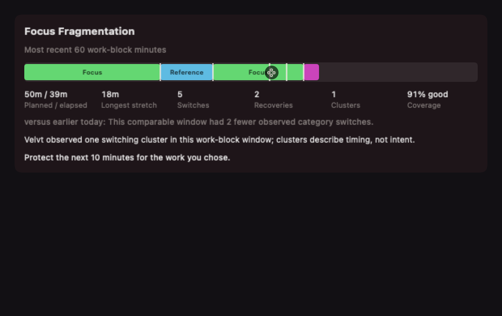
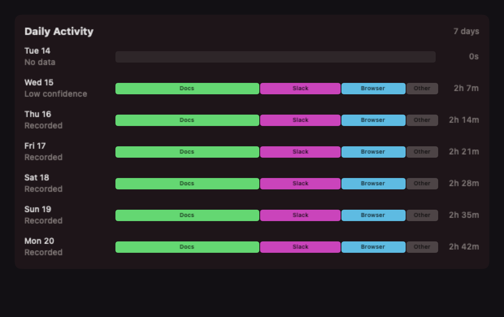

# Scope 3 minimal dashboard handoff

## Outcome

The macOS popover now presents one compact flow: active work-block control when
applicable, latest grounded insight/action, one persisted `Focus` / `Activity`
control, the selected analytical surface, and collapsed settings/privacy/system
state. The previous Today/Week/Activity/Settings navigation rail is no longer
rendered, and the local UI no longer leads with a fragmentation score or a
rolling-average headline.

Focus Fragmentation is explicit work-block Session Analysis, not a third page.
Without a block it invites the user to start one and does not infer intent.
Daily Activity always renders seven rows from bounded local Rust aggregation.

## Contract and implementation

- Branch: `agent/v0.1.5-s3-minimal-dashboard-app-sol`
- Base: accepted app integration at local `origin/main` (`a48246d`)
- Worktree: `/private/tmp/velvt-app-v0.1.5-s3-minimal-dashboard-app-sol`
- IPC: protocol 20; coordinated Rust, Swift, schema, changelog, and build config
- Cluster rule: version 1, three transitions inside an inclusive five minutes
- Comparison: full covered 60 minutes versus an earlier covered 60 minutes today
- Daily labels: local IPC only; five labels plus optional `Other`
- Database migration: none required; existing indexed raw-event and work-block
  tables already contain the bounded local inputs
- Retention/clear data: unchanged and covered by the existing migration,
  retention, and work-block clear-all suites

See [architecture details](architecture/focus-activity-surfaces.md).

## Synthetic screenshots

These renders use fixed synthetic categories, dates, labels, timings, counts,
confidence, observation, and action text. They contain no captured user data.

## Validation

Final verification on Apple Silicon/macOS:

- `cargo test --workspace`: passed, including 138 service unit tests and all
  integration, contract, migration, retention, upload, and doc tests.
- `swift test --package-path swift-client`: 410 passed, one intentional
  environment-gated screenshot test skipped, zero failures.
- Synthetic screenshot test: passed; both compact analytical surfaces rendered
  in 207.769 ms total and were visually inspected.
- Bounded seven-day query fixture: 11.114 ms for 1,400 persisted events
  (guardrail: 250 ms).
- Optimized idle helper after three seconds: 0.0% CPU and 8,816 KiB RSS.
- Rust format check, all-target Clippy with warnings denied, and optimized
  release build: passed.
- `swift format lint --recursive Sources Tests`: completed successfully; it
  reports the repository's existing warning-only formatting backlog.
- Native universal `xcodebuild` application target: `BUILD SUCCEEDED`; only the
  existing asset, metadata, run-script, and stale prior-output warnings were
  emitted.
- Protocol 20 JSON parsing/config consistency and `git diff --check`: passed.
